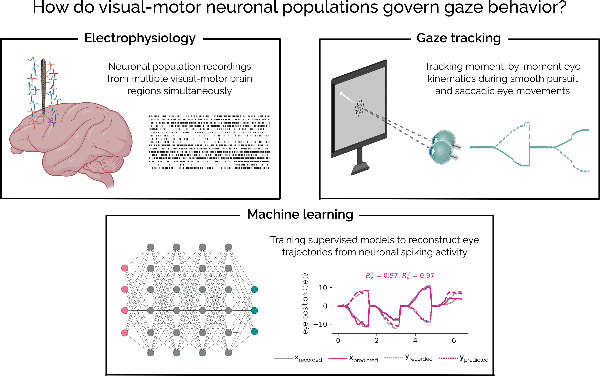

<h1 align="center">Hi 👋, I'm Kendra!</h1>

  <a href="https://github.com/kendranoneman/latex_cv/blob/main/Noneman_CV.pdf" style="text-decoration:none">
    
    Curriculum Vitae
  </a>

- 🔭 I’m currently working on... **decoding gaze behavior from neuronal activity, detecting gaze from videos of human and non-human primates, using computer vision tools to determine real-time gaze from mutliple subjects simultaneously**

- 🌱 I’m currently learning... **OpenCV, human-computer interaction**

- 👯 I’m looking to collaborate on... **analyzing eye traces, detecting eyes/faces from videos, high-performance computing**

- 📝 I regularly write articles on... **visual neuroscience, oculomotor control, smooth pursuit eye movements, machine learning**

- ⚡ Fun fact... **I competed in the hammer throw in college**

## What do I work on?

<h3 align="left">Connect with me:</h3>

<h3 align="left">Languages and Tools:</h3>

            

